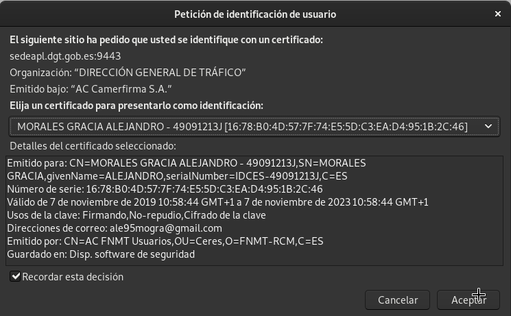

# Certificado digital de persona física

## Tarea 1: Instalación del certificado

#### Una vez que hayas obtenido tu certificado, explica brevemente como se instala en tu navegador favorito.

###### Nos llega un correo con un enlace para descargar el certificado de persona física en la página de Moneda y Timbre.

###### En el formulario le indicamos un codigo que nos llega junto al correo y se nos descargará e instalará en el navegador que tengamos abierto, en mi caso *Firefox* 

#### Muestra una captura de pantalla donde se vea las preferencias del navegador donde se ve instalado tu certificado.

###### Nos tenemos que ir a *Preferencias* > *Privacidad* y *Seguridad* >*Ver Certificados*>*Sus certificados*

#### ¿Cómo puedes hacer una copia de tu certificado?, ¿Como vas a realizar la copia de seguridad de tu certificado?. Razona la respuesta.

###### Nos dirigimos de nuevo en Firefox a *Preferencias* > *Privacidad* y *Seguridad* >*Ver Certificados*>*Sus certificados*, hacemos clic en *Hacer copia* y se nos descargará el certificado en nuestro equipo pero antes nos pedirá que le asignemos una contraseña.

###### Ahora que ya tenemos el certificado, lo mas recomendable es que lo metamos en un usb y que este usb este cifrado.

###### Se pueden utilizar la herramienta *cryptsetup*. Con el dispositivo desmontado y formateado:

~~~
cryptsetup luksFormat /dev/sdc1
   WARNING!
   ========
   Esto sobreescribirá los datos en /dev/sdc1 de forma irrevocable.

   Are you sure? (image/Type uppercase yes): YES
   Introduzca la frase contraseña:
   Verifique la frase contraseña: 

cryptsetup luksOpen /dev/sdc1 LUKS0001
   Introduzca la frase contraseña de /dev/sdc1:

mkfs.ntfs /dev/mapper/LUKS0001 -L ENCRIPTADO

cryptsetup luksClose LUKS0001
~~~

###### Si todo ha salido bien, ya tendremos cifrado nuestro dispositivo usb.

#### Investiga como exportar la clave pública de tu certificado.

###### Para realizar esto, tenemos que realizar el siguiente comando:

~~~
sudo openssl pkcs12 -in certificadoFNMT.p12 -clcerts -nokeys -out AlejandroFNMT.pub.pem
   Enter Import Password:
~~~

## Tarea 2: Validación del certificado

### Instala en tu ordenador el software autofirma y desde la página de VALIDe valida tu certificado. Muestra capturas de pantalla donde se comprueba la validación.

###### Si no tenemos java instalado, tenemos que instalarlo:

~~~
sudo apt-get install default-jre
sudo apt-get install default-jdk
~~~

###### Instalamos Autofirma:

~~~
wget https://estaticos.redsara.es/comunes/autofirma/currentversion/AutoFirma_Linux.zip
unzip AutoFirma_Linux.zip
sudo apt install libnss3-tools
sudo dpkg -i AutoFirma_1_6_5.deb 
~~~

###### Ahora nos dirigimos a la página de VALIDe para validar nuestro certificado:

###### Le damos a *Seleccionar cetificado* y nos saldrá lo siguiente:

###### Le damos a añadir enlace y aceptamos, y nos validará el certificado:

## Tarea 3: Firma electrónica

#### Utilizando la página VALIDe y el programa autofirma, firma un documento con tu certificado y envíalo por correo a un compañero.

###### Nos vamos al apartado *Realizar Firma* en la página VALIDe y le damos a *firmar* y tendremos que seleccionar un fichero:

#### Tu debes recibir otro documento firmado por un compañero y utilizando las herramientas anteriores debes visualizar la firma (Visualizar Firma) y (Verificar Firma). ¿Puedes verificar la firma aunque no tengas la clave pública de tu compañero?, ¿Es necesario estar conectado a internet para hacer la validación de la firma?. Razona tus respuestas.

######  Nos vamos al apartado *Visualizar firma* y *Validar firma* seleccionamos la firma en los dos:

#### Entre dos compañeros, firmar los dos un documento, verificar la firma para comprobar que está firmado por los dos.

######  Ejecutamos el AutoFirma y seleccionamos el fichero de nuestro compañero:

## Tarea 4: Autentificación

#### Utilizando tu certificado accede a alguna página de la administración pública )cita médica, becas, puntos del carnet,…). Entrega capturas de pantalla donde se demuestre el acceso a ellas.

###### Voy a acceder al la página de trafico para ver los puntos de carnet.

###### Le indicamos el acceso con certificado

